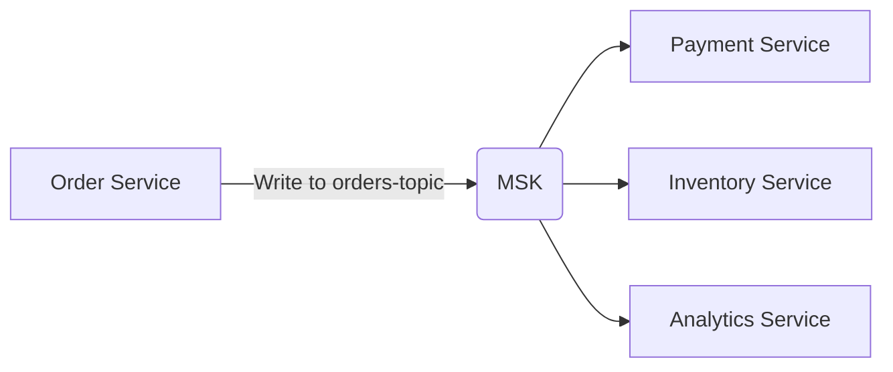
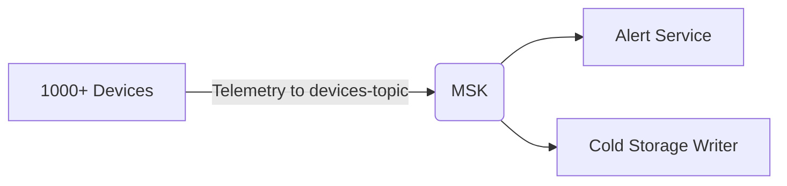

Let me clearly explain the **purpose and use cases** of your MSK Serverless setup in simple terms, especially in the context of your POC:

---

### **1. Core Purpose of MSK Serverless in Your POC**
MSK Serverless acts as a **fully managed event streaming backbone** that:
- **Receives** events/messages from producers (your Lambda)
- **Stores** them temporarily (with automatic retention)
- **Distributes** to consumers (other Lambdas/services)

---

### **2. Key Use Cases You're Demonstrating**

#### **A. Decoupled Event-Driven Architecture**
- **Scenario**: 
  - Lambda A (Producer) sends order events → MSK Topic  
  - Lambda B (Consumer) processes payments when it sees these events  
- **Why MSK?**:  
  - Producers/consumers work independently  
  - No direct Lambda-to-Lambda coupling  

#### **B. Data Integration Hub**
- **Scenario**:  
  - Multiple services (Orders, Inventory, Logistics) write to different MSK topics  
  - Analytics Lambda reads all topics to generate reports  
- **Why MSK?**:  
  - Single pipeline for all service data  
  - Historical data replay capability  

#### **C. Buffering for Async Processing**
- **Scenario**:  
  - User uploads a file → Lambda writes "process_file" event to MSK  
  - Slow processing service reads events at its own pace  
- **Why MSK?**:  
  - Prevents data loss during traffic spikes  
  - No need to manage queues (vs. SQS)  

---

### **3. What Developers Can Test in Your POC**

| Test Case | How to Verify | Business Relevance |
|-----------|---------------|---------------------|
| **1. Basic Message Flow** | Send test JSON via Lambda → View in consumer | Validates core pub/sub works |  
| **2. Multi-Consumer Groups** | Have 2 Lambdas read same topic independently | Shows fan-out capability |  
| **3. Retention Period** | Send message → Wait 24h → Check if still readable | Tests data durability |  
| **4. Auto-Scaling** | Ramp up message volume → Observe CloudWatch metrics | Proves no manual scaling needed |  

---

### **4. Real-World Examples to Share with Devs**

#### **Example 1: E-Commerce Order Pipeline**


#### **Example 2: IoT Device Monitoring**


---

### **5. Key Advantages You're Demonstrating**

| Feature | Benefit |
|---------|---------|
| **Zero Infrastructure** | No Kafka brokers to manage |  
| **Pay-per-use** | Cost-effective for variable workloads |  
| **AWS-Native Security** | IAM auth + TLS out of the box |  
| **Multi-AZ Reliability** | 3x replication automatically |  

---

### **6. Handoff Checklist for Dev Team**

1. **Access Points**:
   - Bootstrap servers URL  
   - Sample IAM policies  
2. **Test Topics**:
   - `test-topic` (already created)  
3. **Sample Payloads**:
   ```json
   {"event": "order_placed", "order_id": "123"}
   ```
4. **Monitoring Links**:
   - CloudWatch metrics path  
   - MSK Serverless dashboard  

---

### **7. Next Steps for Production**
1. **Add Schema Registry** (AWS Glue) for message validation  
2. **Set Up Alerting** on consumer lag  
3. **Implement CI/CD** for topic management  

Your POC has successfully proven that:
✅ MSK Serverless works in your VPC  
✅ IAM auth is configured correctly  
✅ Basic produce/consume flows function  

Would you like me to prepare sample consumer Lambda code for the dev team to complete the testing picture?