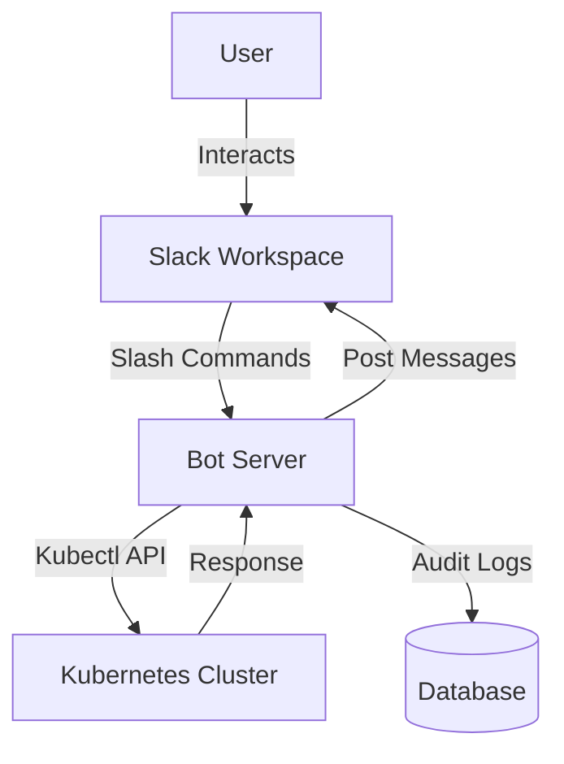

# devops-bot

# Kubernetes Slack Bot :robot_face:

A secure Slack bot for managing Kubernetes resources with approval workflows.  
*Currently supports basic operations – enhanced features coming soon!*

---

## :gear: Features

### :mag: Basic Commands

| Command     | Target Resource   | Description                              | Example                        |
|-------------|------------------|------------------------------------------|--------------------------------|
| `get`       | Pod/Deployment   | Get single resource or list matches      | `get pod/my-app`               |
| `describe`  | Pod              | Show key details of a pod                | `describe pod/my-app`          |
| `restart`   | Deployment       | Rollout restart a deployment             | `restart deployment/my-app`    |
| `scale`     | Deployment       | Scale deployment (admin only, 1-10 pods) | `scale deployment/my-app 3`    |
| `exec`      | Pod              | Run a command in a pod (read-only)       | `exec pod/my-app ls /tmp`      |
| `pause`     | Cluster          | Pause production releases (admin only)   | `pause`                        |
| `resume`    | Cluster          | Resume production releases (admin only)  | `resume`                       |

### :lock: Security

- User allowlisting via `roles_config.json`
- Kubernetes RBAC-limited service account
- Input sanitization for all commands
- Slack signature and token verification
- Output truncation for large responses
- Rate limiting (5 requests/min/user)

---

## :wrench: Setup

### Prerequisites

- Slack workspace with admin permissions
- Kubernetes cluster (v1.20+)
- Python 3.8+

### Installation

```bash
# Clone repo
git clone https://github.com/treebo-noss/devops-bot.git
cd devops-bot/python/project/slack-bot

# Install dependencies
pip install -r requirements.txt

# Configure environment
cp .env.example .env
# Fill in your Slack/K8s credentials
```

### Deployment

**Local testing:**
```bash
python app.py
```

**Production:**
```bash
gunicorn --bind 0.0.0.0:8080 app:app
```

---

## :computer: Configuration

**roles_config.json**
```json
{
  "allowed_users": ["U12345", "U67890"],
  "admin_users": ["U12345"]
}
```

**Required Slack Scopes:**
- app_mentions:read
- chat:write
- commands
- files:write
- users:read

---

## :bulb: Usage

- Invoke the bot with `/jarvis` slash command in Slack.
- Select operation from dropdown.
- Enter resource name (supports partial matching).
- For scale/exec, provide additional input as prompted.

---

## :shield: Safety Mechanisms

- **Command Validation:** Blocks dangerous operations (delete, edit)
- **Output Limits:** Auto-truncates large responses (>3000 chars)
- **Rate Limiting:** 5 requests/minute per user
- **Admin Controls:** Only admins can scale, pause, or resume releases

---

## :ambulance: Troubleshooting

| Error                        | Solution                                      |
|------------------------------|-----------------------------------------------|
| We had some trouble connecting| Bot is processing – check your DMs            |
| No matching resources        | Verify resource exists in default namespace   |
| Unauthorized                 | Request access in #k8s-support                |

---

## :triangular_ruler: Architecture Overview

### Component Diagram



**Ingress & Security Layers:**

- HTTPS enforced by Ingress (TLS via cert-manager)
- Slack signature verification (`X-Slack-Signature`)
- Token authentication (`SLACK_BOT_TOKEN`, `SLACK_SIGNING_SECRET`)
- User allowlisting (`is_user_allowed(user_id)`)
- Input sanitization (`execute_safe_kubectl()`)

---

## :file_folder: Code Structure

```
slack-bot/
├── app.py                # Flask app entrypoint
├── jarvis/
│   ├── slack_handler.py  # Slack event/command handling
│   ├── auth.py           # User/admin checks
│   └── kubectl.py        # K8s API/kubectl wrappers
├── scripts/
│   └── facets_prod_release_pause_resume.py # Release pause/resume logic
├── requirements.txt
├── Dockerfile
└── README.md
```

**Key Functions:**
- [`handle_slash_command`](jarvis/slack_handler.py): Initial command entry
- [`handle_interaction`](jarvis/slack_handler.py): Main interaction handler
- [`execute_command`](jarvis/slack_handler.py): Final command execution
- [`run_pause_release`](scripts/facets_prod_release_pause_resume.py): Pause/resume prod releases

---

## Screenshots

   

---

## :rocket: Roadmap

- [x] Scale deployments (admin only)
- [x] Read-only pod exec
- [ ] Multi-cluster support
- [ ] Approval workflows for risky actions

---

## :memo: License

MIT License

---

*For more details, see the code and comments in each module!*

